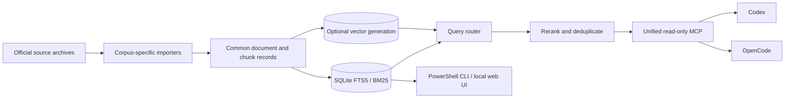

# Offline AI Workstation

[](https://github.com/chase-irql/ai-workstation/actions/workflows/rag-tests.yml)
[](LICENSE)
[](#requirements)

A local-first, model-agnostic system for acquiring, indexing, evaluating, and searching an offline knowledge library.

The project combines source-backed retrieval with local coding agents and language models. Its durable part is the knowledge infrastructure—not any particular model, vector database, or agent harness. Models can be replaced without rebuilding the corpus collection.

> This repository contains the software and reproducible dataset manifests. It does **not** contain Wikipedia, documentation archives, generated indexes, model weights, or private documents.

## What it does

- Acquires datasets with resumable downloads, checksums, size limits, and atomic publication.
- Converts corpus-specific sources into a shared document and chunk schema.
- Builds independently replaceable SQLite FTS5/BM25 indexes.
- Adds optional local embeddings and hybrid retrieval without removing the CPU-only baseline.
- Routes exact identifiers toward lexical search and conceptual questions toward hybrid search.
- Reranks and deduplicates evidence while preserving citations and alternate provenance.
- Exposes every published corpus through one read-only MCP server for Codex and OpenCode.
- Evaluates retrieval with versioned suites, stable document IDs, ranking metrics, and latency measurements.
- Keeps corpora, indexes, models, and agent harnesses decoupled.

## Working corpora

These corpora are implemented and verified in the current development installation. They are not bundled with the repository.

| Corpus | Pinned source | Scale | Retrieval |
|---|---|---:|---|
| English Wikipedia | `enwiki-20260801` | 7.2M searchable articles, 35.8M chunks | BM25 + article-level hybrid |
| Python documentation | Python 3.14.7 | 565 documents, 8,840 chunks | BM25 + chunk-level hybrid |
| Git documentation | Git 2.55.0 | 985 documents, 4,953 chunks | BM25 + chunk-level hybrid |
| Linux man-pages | 6.18 | 1,245 documents, 13,155 chunks | BM25 + chunk-level hybrid |
| RFC Editor | 2026-08-19 snapshot | 9,822 RFCs, 348,831 chunks | BM25 + chunk-level hybrid |
| IANA protocol registries | 2026-08-19 snapshot | 4,256 registries, 114,590 chunks | Structured BM25 |
| SQLite documentation | SQLite 3.53.4 | 765 documents, 4,384 chunks | BM25 + chunk-level hybrid |
| CMake documentation | CMake 4.4.2 | 2,144 documents, 4,226 chunks | BM25 |
| OpenSSL documentation | OpenSSL 4.0.1 | 960 manuals, 8,287 chunks | BM25 |
| OpenSSH Portable manuals | OpenSSH 10.5p1 | 19 documents, 195 chunks | BM25 |
| Ninja manual | Ninja 1.13.2 | 1 manual, 58 chunks | BM25 |
| PostgreSQL documentation | PostgreSQL 18.6 | 1,148 documents, 6,931 chunks | BM25 |
| systemd documentation | systemd 261.2 | 542 manuals/guides, 9,614 chunks | BM25 |
| Node.js documentation | Node.js 24.19.0 LTS Krypton | 126 API/guides, 5,732 chunks | BM25 |
| Apache HTTP Server documentation | Apache httpd 2.4.68 | 232 manuals, 3,055 chunks | BM25 |
| Docker documentation | Official snapshot at `510f85c…` (2026-08-20) | 1,174 documents, 11,190 chunks | BM25 |
| Kubernetes documentation | Official snapshot at `5184b9b…` (2026-08-20) | 1,605 documents, 14,164 chunks | BM25 |
| Rust documentation | Rust 1.97.1 stable | 7,570 documents, 57,178 chunks | BM25 |
| TypeScript documentation | Official snapshot at `90e92beb…` (2026-08-20) | 77 documents, 935 chunks | BM25 |
| GNU GDB manual | GDB 17.2 last-release documentation | 863 documents, 2,225 chunks | BM25 |
| GNU GCC manual | GCC 16.2 release documentation | 523 documents, 1,695 chunks | BM25 |
| Linux kernel documentation | Linux 7.2 release source | 4,154 documents, 29,142 chunks | BM25 |
| LLVM Project documentation | LLVM 22.1.8 coordinated release | 2,352 documents, 18,655 chunks | BM25 |
| Go documentation and standard library | Go 1.26.7 stable source | 1,320 documents, 18,647 chunks | BM25 |
| Podman documentation | Podman 6.1.0 signed release | 223 manuals/guides, 2,484 chunks | BM25 |
| GNU Binutils documentation | Binutils 2.47 official HTML manuals | 8 manuals, 1,807 chunks | BM25 |
| .NET documentation | Official `dotnet/docs` snapshot at `e2fe6aca…` | 13,225 pages, 77,212 chunks | BM25 |
| NGINX documentation | Official `nginx/nginx.org` snapshot at `df444293…` | 149 documents, 1,669 chunks | BM25 |
| OpenStax Calculus Volumes 1–3 | Official source snapshot at `8dbc2ce…` | 133 modules, 11,807 chunks | BM25 |
| OpenStax University Physics Volumes 1–3 | Official source snapshot at `d0ed34a…` | 322 modules, 8,870 chunks | BM25 |
| OpenStax Chemistry 2e + Atoms First 2e | Official source snapshot at `3be4b60…` | 176 modules, 4,499 chunks | BM25 |
| OpenStax Biology 2e + AP + Concepts | Official source snapshot at `63f8b6f…` | 574 modules, 10,795 chunks | BM25 |
| OpenStax Anatomy and Physiology 2e | Official source snapshot at `716383a…` | 198 modules, 4,590 chunks | BM25 |
| OpenStax Prealgebra, Elementary Algebra, and Intermediate Algebra 2e | Official source snapshot at `38cae454…` | 240 modules, 33,138 chunks | BM25 |
| OpenStax College Algebra, Algebra and Trigonometry, and Precalculus 2e | Official source snapshot at `789b5409…` | 138 modules, 17,596 chunks | BM25 |
| OpenStax Introductory Statistics and Introductory Business Statistics 2e | Official source snapshot at `1f6a3582…` | 179 modules, 6,011 chunks | BM25 |
| OpenStax Microbiology | Official source snapshot at `63385025…` | 159 modules, 4,115 chunks | BM25 |
| OpenStax Astronomy 2e | Official source snapshot at `dff6acf8…` | 199 modules, 2,095 chunks | BM25 |
| OpenStax Principles of Economics 3e + micro/macro/AP | Official source snapshot at `d5cadb40…` | 190 modules, 2,787 chunks | BM25 |
| OpenStax Psychology 2e | Official source snapshot at `de7e40c9…` | 105 modules, 2,228 chunks | BM25 |
| GNU C Preprocessor manual | GCC 16.2 release documentation | 76 documents, 183 chunks | BM25 |
| FAA AMT Handbook — General | FAA-H-8083-30B, 2023 | 677 pages, 1,837 chunks | Page-aware BM25 |
| DOE Fundamentals Handbooks | DOE-HDBK-1010-92 through 1019-93, Revision 0 archive | 22 volumes, 2,842 pages, 5,533 chunks | Page-aware BM25 |
| GNU Bash reference manual | Bash 5.3, 2025-07-04 generation | 132 documents, 386 chunks | BM25 |
| GNU Coreutils manual | Coreutils 9.11, 2026-04-20 generation | 253 documents, 639 chunks | BM25 |
| GNU Awk user's guide | Gawk 5.4, 2026-02-22 generation | 502 documents, 1,332 chunks | BM25 |
| GNU Grep manual | Grep 3.12, 2025-04-11 generation | 31 documents, 82 chunks | BM25 |
| GNU Make manual | Make 4.4.1, 2023-02-26 generation | 173 documents, 444 chunks | BM25 |
| GNU Sed manual | 2026-04-22 generation | 67 documents, 174 chunks | BM25 |
| GNU Tar manual | Tar 1.35.90, 2026-06-11 generation | 411 documents, 733 chunks | BM25 |
| GNU Findutils manual | Findutils 4.11.0, 2026-07-14 generation | 147 documents, 337 chunks | BM25 |
| GNU Diffutils manual | Diffutils 3.12, 2025-04-09 generation | 113 documents, 246 chunks | BM25 |
| GNU C Library manual | glibc 2.44, 2026-07-27 generation | 776 documents, 2,164 chunks | BM25 |
| GNU Gzip manual | Gzip 1.14, 2025-04-10 generation | 10 documents, 30 chunks | BM25 |
| GNU Wget manual | Wget 1.25.0, 2024-11-11 generation | 51 documents, 149 chunks | BM25 |
| GNU GRUB manual | GRUB 2.14, 2026-01-14 generation | 600 documents, 1,280 chunks | BM25 |
| DevOps Stack Exchange | 2026-06-30 community dump | 11,877 retained posts, 13,531 chunks | BM25 + experimental chunk-level hybrid |
| Information Security Stack Exchange | 2026-06-30 community dump | 171,041 retained posts, 188,770 chunks | BM25 + chunk-level hybrid |
| Network Engineering Stack Exchange | 2026-06-30 community dump | 39,592 retained posts, 44,174 chunks | BM25; semantic generation published |
| Database Administrators Stack Exchange | 2026-06-30 community dump | 220,788 retained posts, 262,323 chunks | BM25; semantic generation published |
| Electrical Engineering Stack Exchange | 2026-06-30 community dump | 509,806 retained posts, 545,211 chunks | BM25; semantic generation in progress |
| Unix & Linux Stack Exchange | 2026-06-30 community dump | 528,891 retained posts, 602,485 chunks | BM25; semantic generation queued |
| Server Fault Stack Exchange | 2026-06-30 community dump | 704,713 retained posts, 775,708 chunks | BM25; semantic generation queued |
| Software Engineering Stack Exchange | 2026-06-30 community dump | 214,014 retained posts, 239,207 chunks | BM25 |
| Computer Science Stack Exchange | 2026-06-30 community dump | 101,644 retained posts, 109,770 chunks | BM25 |
| Arduino Stack Exchange | 2026-06-30 community dump | 52,338 retained posts, 62,506 chunks | BM25 |
| Raspberry Pi Stack Exchange | 2026-06-30 community dump | 75,998 retained posts, 85,362 chunks | BM25 |
| Signal Processing Stack Exchange | 2026-06-30 community dump | 60,376 retained posts, 66,988 chunks | BM25 |
| Super User Stack Exchange | 2026-06-30 community dump | 1,030,135 retained posts, 1,110,380 chunks | BM25 |
| Ask Ubuntu Stack Exchange | 2026-06-30 community dump | 789,887 retained posts, 901,300 chunks | BM25 |

The evaluation suites are deliberately small quality gates, not claims of universal retrieval accuracy. Source versions, licenses, checksums, local paths, and update rules for every published corpus are summarized in the [corpus catalog](docs/corpus-catalog.md). Current measurements and limitations are documented in [corpus-semantic-roadmap.md](docs/corpus-semantic-roadmap.md), [documentation-corpus-ingestion.md](docs/documentation-corpus-ingestion.md), and [openstax-ingestion.md](docs/openstax-ingestion.md).

## Architecture



Each corpus keeps its own source version, manifests, index, citations, and evaluation history. The MCP server federates those indexes at query time instead of merging the library into one fragile database.

Semantic resources are lazy. Starting the retrieval server does not load an embedding model, and callers can request `retrieval="bm25"` for a guaranteed CPU-only search.

## Quick start

### Requirements

The automation is currently Windows-first.

- Windows 10 or 11
- PowerShell
- Git
- Python 3.14
- Ollama only for embeddings or local chat models
- Codex CLI or OpenCode only when using an agent harness
- WSL with `rsync` for the RFC Editor and IANA acquisition adapters

Clone the repository and install the Python environment:

```powershell
git clone https://github.com/chase-irql/ai-workstation.git
cd ai-workstation

py -3.14 -m venv .venv
.\.venv\Scripts\python.exe -m pip install --upgrade pip
.\.venv\Scripts\python.exe -m pip install -r rag\requirements-dev.txt

.\.venv\Scripts\python.exe -m pytest rag\tests -q
.\scripts\validate-dataset-registry.ps1
```

### Build a small first corpus

Python's official documentation is a practical first run. It is small enough to validate the complete acquisition-to-query path before attempting Wikipedia.

```powershell
.\scripts\acquire-dataset.ps1 -DatasetId python-3.14-docs -Extract

.\scripts\run-documentation-pilot.ps1 `
  -DatasetId python-3.14-docs `
  -SourceRoot .\corpora\raw\documentation\python-3.14\extracted

.\scripts\query-documentation.ps1 `
  -DatasetId python-3.14-docs `
  -Query 'asyncio TaskGroup cancellation'
```

Those commands use CPU-only BM25 retrieval. No chat model is loaded.

### Add semantic retrieval

After the BM25 index passes its evaluation gate, build and evaluate an independent vector generation:

```powershell
.\scripts\pull-model.ps1 -ModelId qwen3-embedding-0.6b
.\scripts\run-corpus-semantic.ps1 -DatasetId python-3.14-docs

.\scripts\evaluate-corpus-semantic.ps1 `
  -DatasetId python-3.14-docs `
  -Suite rag\eval\python-docs-semantic-v1.json
```

The embedding model is selected from [models.json](config/models.json). Vectors are published only after the generation passes structural validation.

## Use the knowledge system with an agent

The current checked-in MCP profile represents the complete development installation. Configure it after the full Wikipedia index and every dataset marked `evaluated` in `config/datasets.json` exist locally:

```powershell
.\scripts\configure-knowledge-mcp.ps1 -Harness all
```

Launch Codex with an isolated local-model configuration:

```powershell
.\scripts\start-codex.ps1
```

The launcher asks for a working directory and displays the installed non-embedding Ollama models. Use the arrow keys and Enter to select one. The launcher's temporary `CODEX_HOME` does not modify your normal global Codex configuration.

Or launch OpenCode:

```powershell
.\scripts\start-opencode.ps1
```

Example agent prompt:

```text
Use the offline knowledge tools to explain the TLS 1.3 key schedule.
Search the RFC corpus first, retrieve neighboring context where useful,
distinguish current specifications from obsolete RFCs, and preserve exact citations.
```

The MCP server exposes four tools:

| Tool | Purpose |
|---|---|
| `search_knowledge` | Search one or more corpora with automatic, BM25, semantic, or hybrid retrieval. |
| `retrieve_knowledge_context` | Expand a result into a bounded window of neighboring chunks. |
| `retrieve_knowledge_document` | Read a document safely in small pages. |
| `knowledge_index_status` | Inspect source versions, counts, retrieval modes, and semantic availability. |

See [unified-knowledge-mcp.md](docs/unified-knowledge-mcp.md) for routing behavior, corpus filters, fallback behavior, and more examples.

## Wikipedia

Wikipedia uses a multistream-aware extractor with deterministic sharding and block-level resume. The download is roughly 27 GB before extraction and indexing, so begin with the small documentation workflow above unless you specifically want the full encyclopedia.

```powershell
.\scripts\download-wikipedia.ps1 -DumpDate 20260801
.\scripts\get-wikipedia-download-status.ps1 -DumpDate 20260801
.\scripts\run-wikipedia-full.ps1
.\scripts\get-wikipedia-full-status.ps1
```

After interruption or reboot, resume rather than starting over:

```powershell
.\scripts\run-wikipedia-full.ps1 -Resume
```

Query the completed index without loading an LLM:

```powershell
.\scripts\query-wikipedia.ps1 -Query 'Apollo guidance computer'
```

Or start the read-only localhost service and open `http://127.0.0.1:8765/`:

```powershell
.\scripts\start-wikipedia-service.ps1 -Background
.\scripts\get-wikipedia-service-status.ps1
.\scripts\stop-wikipedia-service.ps1
```

Update planning is side-by-side and reuse-aware; it does not require blindly recomputing every embedding. See [wikipedia-corpus-updates.md](docs/wikipedia-corpus-updates.md).

## Safety and reproducibility

- Existing corpora and databases are protected from accidental overwrite.
- Indexes are built beside the target, validated, and atomically replaced only with explicit authorization.
- Dataset manifests record releases, source URLs, hashes, licenses, paths, and processing status.
- Partial downloads and interrupted vector generations are resumable.
- Stable document IDs and content-derived IDs support comparisons and embedding reuse across updates.
- Retrieval results retain source URLs, versions, headings, timestamps, and ready-to-use citations.
- MCP and HTTP retrieval interfaces are read-only by default.

The common lifecycle is:

```text
planned -> downloaded -> validated -> extracted -> parsed -> indexed -> evaluated
```

## Repository layout

| Path | Contents |
|---|---|
| `rag/src/offline_rag/` | Acquisition, import, indexing, retrieval, evaluation, services, and MCP code |
| `rag/tests/` | Synthetic fixtures and automated tests |
| `rag/eval/` | Versioned retrieval evaluation suites |
| `config/datasets.json` | Dataset registry, versions, licenses, storage bounds, and paths |
| `rag/src/offline_rag/pdf_manuals.py` | Page-aware, OCR-gated PDF/manual importer |
| `scripts/run-pdf-manual-pipeline.ps1` | Registry-driven PDF import and atomic BM25 build |
| `config/models.json` | Replaceable local model and embedding-model registry |
| `scripts/` | Windows-native operational commands |
| `docs/` | Architecture, measurements, update procedures, and design decisions |
| `benchmarks/` | Reproducible Codex/OpenCode agent tasks |
| `corpora/` | Local source and processed data; ignored by Git |
| `indexes/` | Generated lexical and vector indexes; ignored by Git |
| `models/` | Local model storage; ignored by Git |
| `results/` | Generated benchmark and evaluation evidence; ignored by Git |

## Adding another corpus

New corpora should not be flattened through a generic PDF loader. Each source type should preserve the structure that makes it useful: headings, code blocks, tables, document versions, question/answer relationships, RFC status, manual model numbers, page references, or other corpus-specific metadata. The first [PDF/manual adapter](docs/pdf-manual-ingestion.md) now preserves page and outline citations, checks text-layer coverage, and refuses low-coverage scans until an explicit OCR stage is available.

The expected sequence is:

1. Add source, license, version, storage bounds, and paths to `config/datasets.json`.
2. Implement or select a corpus-specific acquisition and parsing adapter.
3. Publish common document and chunk records with stable IDs and provenance.
4. Build and validate an atomic BM25 index.
5. Add a versioned lexical evaluation suite.
6. Build embeddings only when conceptual retrieval would add value.
7. Compare BM25 and hybrid results before activating semantic routing.
8. Reconfigure the unified MCP server after the corpus is marked `evaluated`.

Read [rag-record-schema.md](docs/rag-record-schema.md) and [documentation-corpus-ingestion.md](docs/documentation-corpus-ingestion.md) before implementing an importer.

## Data and licensing

The Apache-2.0 license covers this project's original code and documentation. Downloaded corpora and model weights retain their upstream licenses. Some generated indexes contain recoverable source text and may have their own redistribution constraints.

Do not commit corpora, indexes, model files, generated results, credentials, or personal documents. See [data-distribution-policy.md](docs/data-distribution-policy.md) for the release policy.

## Development

Before submitting a change:

```powershell
.\.venv\Scripts\python.exe -m pytest rag\tests -q
.\scripts\validate-dataset-registry.ps1
git diff --check
```

Contributions are welcome. Start with [CONTRIBUTING.md](CONTRIBUTING.md), and report sensitive issues through the process described in [SECURITY.md](SECURITY.md).

## Project status

This is working software under active development, not a turnkey archive download. It is currently optimized for one Windows workstation and has not yet been packaged as a cross-platform installer. The retrieval components are intentionally independent of Ollama, Codex, OpenCode, and any hosted model provider so those integrations can change without invalidating the knowledge library.

The bounded-memory Stack Exchange XML adapter is now validated across 14 sites totaling 4,511,100 retained posts and 5,007,715 chunks. The next major adapter should target manuals/PDFs or textbooks; JATS scientific literature and other high-value sources likewise require structure-preserving importers rather than a generic document loader.

## License

[Apache License 2.0](LICENSE)
